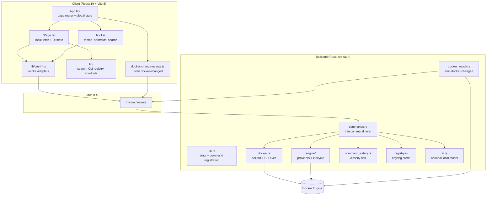

# Architecture Audit: Oxidock

**Author:** OSS architecture audit (automated)  
**Date:** May 27, 2026  
**Scope:** Full project analysis for OSS maintainability — structure, modularity, state, navigation, Tauri/Docker integration, styling, performance, accessibility, tooling, security boundaries, and contributor readiness. React Doctor (score **70/100**, 206 warnings) used as supporting evidence, not as the primary rubric.

---

## Executive Summary

### What Oxidock Does

Oxidock is a **desktop Docker management app** built with **Tauri 2** and **React 19**. The UI runs in a Vite-bundled webview; the Rust backend talks to Docker Engine via **bollard** and exposes typed commands to the frontend through Tauri `invoke`. Users browse containers, images, volumes, networks, and events; inspect logs and stats; manage engine providers (Docker Desktop, Colima, OrbStack, etc.); configure registries; run a guarded **CLI playground**; and use in-app docs plus intelligent search across Docker resources.

**Relevant features:**

- **Containers dashboard** — List, group, inspect, start/stop/restart/remove, live stats, Docker change events.
- **Images / volumes / networks / events** — Resource pages with search filtering and engine-aware refresh.
- **Logs viewer** — Per-container log streaming via backend.
- **CLI playground** — Arbitrary `docker` CLI execution with client-side destructive-command protection and Rust-side classification API.
- **Engine & registry settings** — Provider selection, lifecycle actions, registry CRUD, credentials in OS keyring.
- **Docs & intelligent search** — Static command lessons/registries plus cross-resource search from the title bar.

**Problem it solves:** Developers want a **native, focused Docker UI** without living in the terminal or Docker Desktop alone — Oxidock centralizes visibility and common operations while still allowing raw CLI when needed.

### Architecture Diagram



**Legend:** React owns presentation and orchestration; thin TypeScript adapters call Tauri commands; Rust modules own Docker connectivity, safety classification, registry secrets, and background watch events that push UI refreshes.

---

### Architecture Status

| Area             | Status | Notes                                                                                                        |
| ---------------- | ------ | ------------------------------------------------------------------------------------------------------------ |
| File Structure   | Info   | Clear `src/` vs `src-tauri/` split; large static libs and monolithic Rust modules increase review cost.      |
| Hooks            | Medium | Only four custom hooks; missing shared abstractions for repeated resource-page loading.                      |
| State Management | Medium | No global store — simple but concentrates cross-page behavior in [`src/App.tsx`](src/App.tsx).               |
| Components       | Info   | Consistent `*Page` + [`page-shell`](src/components/page-shell.tsx) pattern; several 300–600 line components. |
| Routing          | Info   | In-app `AppPage` switch (not URL router); appropriate for Tauri desktop.                                     |
| API & Data       | High   | Strong `tauri-*` adapter layer; **CLI execution not gated server-side** — OSS security concern.              |
| Styling          | Info   | Tailwind 4 + [`App.css`](src/App.css); some redundant utility patterns (React Doctor design rules).          |
| Performance      | Medium | Large static registries; parallel search fetches; no route-level code splitting.                             |
| Accessibility    | Medium | React Doctor: 22 a11y warnings; desktop app still needs keyboard/label coverage.                             |
| Infrastructure   | High   | Tauri build present; **no CI**, template README, or contributor docs — blocks OSS handoff.                   |

**OSS readiness verdict:** **Pre-OSS** — solid application architecture for a solo/small team product, but **not yet maintainable as a public OSS repo** without license, contributor docs, automated checks, documented security model, and targeted modularization of hot spots.

---

## 1. File Structure

### Finding 1.1: Top-Level Layout

**Severity:** Info

| Path                                                           | Purpose                                                                  |
| -------------------------------------------------------------- | ------------------------------------------------------------------------ |
| [`src/`](src/)                                                 | React UI: components, hooks, lib adapters, types                         |
| [`src-tauri/`](src-tauri/)                                     | Rust backend: Docker, engine, registry, AI, menus, watch                 |
| [`index.html`](index.html), [`vite.config.ts`](vite.config.ts) | Vite entry; `@/` alias to `src/`; dev server port 1420 for Tauri         |
| [`package.json`](package.json)                                 | Frontend scripts: `dev`, `build`, `lint`, `doctor`                       |
| [`src-tauri/Cargo.toml`](src-tauri/Cargo.toml)                 | Rust deps: `bollard`, `tokio`, `reqwest`, `keyring`, `sysinfo`           |
| [`src-tauri/tauri.conf.json`](src-tauri/tauri.conf.json)       | Window chrome, bundle, **CSP null**                                      |
| [`.agents/skills/react-doctor/`](.agents/skills/react-doctor/) | Agent skill for React health checks (duplicated under 7 other tool dirs) |

**Recommendation:** Document this layout in README / `docs/architecture.md` for contributors. Consolidate agent skills to a single canonical copy (e.g. [`.agents/skills/react-doctor/SKILL.md`](.agents/skills/react-doctor/SKILL.md)) to avoid drift.

### Finding 1.2: Frontend Module Boundaries

**Severity:** Medium

| Area               | Files                                                                                                                                                                                                                           | Concern                                                       |
| ------------------ | ------------------------------------------------------------------------------------------------------------------------------------------------------------------------------------------------------------------------------- | ------------------------------------------------------------- |
| Tauri adapters     | [`src/lib/tauri-docker.ts`](src/lib/tauri-docker.ts), [`tauri-engine.ts`](src/lib/tauri-engine.ts), [`tauri-registry.ts`](src/lib/tauri-registry.ts)                                                                            | Good boundary — components should not call `invoke` directly. |
| Knowledge / search | [`docker-command-registry.ts`](src/lib/docker-command-registry.ts) (~653 lines), [`docker-command-registry-advanced.ts`](src/lib/docker-command-registry-advanced.ts), [`intelligent-search.ts`](src/lib/intelligent-search.ts) | Large static data + logic; hard to review in PRs.             |
| Types              | [`src/types/`](src/types/)                                                                                                                                                                                                      | TS DTOs must stay aligned with Rust serde structs manually.   |

**Recommendation:** Split registries into generated or folder-per-domain modules; add a short “type sync” checklist (TS ↔ Rust) to CONTRIBUTING.

### Finding 1.3: Backend Module Concentration

**Severity:** High

| File                                                         | ~Lines | Concern                                                            |
| ------------------------------------------------------------ | ------ | ------------------------------------------------------------------ |
| [`src-tauri/src/docker.rs`](src-tauri/src/docker.rs)         | 1251   | Containers, images, events, stats, logs, **CLI exec**, DTO mapping |
| [`src-tauri/src/engine/mod.rs`](src-tauri/src/engine/mod.rs) | 828    | Provider detection, connection, config persistence                 |

**Recommendation:** Split `docker.rs` into submodules (`containers`, `images`, `cli`, `events`) before OSS launch to lower review burden and enable focused tests.

---

## 2. Hooks

### Finding 2.1: Custom Hooks Inventory

**Severity:** Info

| File                                                                         | Purpose                                                                                |
| ---------------------------------------------------------------------------- | -------------------------------------------------------------------------------------- |
| [`src/hooks/use-theme.ts`](src/hooks/use-theme.ts)                           | Theme preference via [`theme-settings.ts`](src/lib/theme-settings.ts) / `localStorage` |
| [`src/hooks/use-app-shortcuts.ts`](src/hooks/use-app-shortcuts.ts)           | Global keyboard shortcuts from [`shortcut-settings.ts`](src/lib/shortcut-settings.ts)  |
| [`src/hooks/use-intelligent-search.ts`](src/hooks/use-intelligent-search.ts) | Search index + debounced registry queries (used from title bar)                        |
| [`src/hooks/use-app-resource-usage.ts`](src/hooks/use-app-resource-usage.ts) | Polls app metrics from Tauri                                                           |

### Finding 2.2: Missing Shared Resource Hook

**Severity:** Medium

[`src/components/volumes-page.tsx`](src/components/volumes-page.tsx), [`networks-page.tsx`](src/components/networks-page.tsx), [`events-page.tsx`](src/components/events-page.tsx), and similar pages duplicate the same pattern: `useCallback` loader, `useEffect` with `engineRevision`, `dockerStatus?.isRunning` guard, `PageShell` error/loading.

**Recommendation:** Extract `useDockerResourcePage<T>({ fetch, enabled })` (or feature hooks per resource) to reduce copy-paste and standardize invalidation when `engineRevision` changes.

---

## 3. State Management

### Finding 3.1: No Global Client Store

**Severity:** Info

There is **no** React Context, Zustand, Redux, or TanStack Query. State is **distributed**:

| Owner                        | State                                                                                                           |
| ---------------------------- | --------------------------------------------------------------------------------------------------------------- |
| [`src/App.tsx`](src/App.tsx) | `activePage`, `dockerStatus`, `engineRevision`, `searchQuery`, docs/CLI/images modes, shortcuts, menu listeners |
| Each `*Page.tsx`             | Resource lists, selection, page errors                                                                          |
| Rust `manage()`              | Docker client cache, engine config, watch generation, metrics ([`src-tauri/src/lib.rs`](src-tauri/src/lib.rs))  |
| `localStorage`               | Theme, shortcuts, CLI playground settings                                                                       |

**Confidence:** High — appropriate for current scale; tradeoff is coordination complexity in `App.tsx`.

### Finding 3.2: Engine Invalidation Model

**Severity:** Info

`engineRevision` increments when the engine changes ([`src/components/sidebar.tsx`](src/components/sidebar.tsx), [`src/components/engine-settings-panel.tsx`](src/components/engine-settings-panel.tsx)). Child pages receive it as a prop and refetch via `useEffect` deps — not via a shared cache.

**Recommendation:** If data fetching grows, consider a lightweight “engine context” or query layer; not required for v0.1 but document the invalidation contract for contributors.

### Finding 3.3: App-Level Coordinator Growth

**Severity:** Medium

[`src/App.tsx`](src/App.tsx) (~366 lines) owns routing, search result actions, shortcuts, Tauri menu events, status loading, and `pageContent` `useMemo` with a large dependency array.

**Recommendation:** Extract `useAppNavigation`, `useMenuActions`, and/or a `AppRouter` component to keep `App.tsx` readable for OSS reviewers.

---

## 4. Component Naming & Structure

### Finding 4.1: Conventions

**Severity:** Info

- **Files:** kebab-case (`containers-page.tsx`, `cli-playground-page.tsx`)
- **Components:** PascalCase exports matching file purpose
- **UI primitives:** [`src/components/ui/select.tsx`](src/components/ui/select.tsx) (Radix-based)
- **Shells:** [`app-shell.tsx`](src/components/app-shell.tsx), [`page-shell.tsx`](src/components/page-shell.tsx) — good reuse

### Finding 4.2: Large Presentational / Feature Components

**Severity:** Medium

| File                                                                          | ~Lines | Notes                                                     |
| ----------------------------------------------------------------------------- | ------ | --------------------------------------------------------- |
| [`icons.tsx`](src/components/icons.tsx)                                       | 590    | Icon barrel — consider splitting or tree-shaking strategy |
| [`registry-settings-panel.tsx`](src/components/registry-settings-panel.tsx)   | 392    | Settings + credentials UX                                 |
| [`cli-command-autocomplete.tsx`](src/components/cli-command-autocomplete.tsx) | 368    | Autocomplete + AI suggestions                             |
| [`sidebar.tsx`](src/components/sidebar.tsx)                                   | 346    | Nav **and** engine lifecycle controls                     |
| [`container-inspector.tsx`](src/components/container-inspector.tsx)           | 314    | Multi-tab inspect UI                                      |

**Recommendation:** Split sidebar engine controls into `engine-controls.tsx` shared with settings panel to remove duplicated lifecycle UI (also flagged in prior exploration).

---

## 5. Routing

### Finding 5.1: In-App Page Switch (Not URL Router)

**Severity:** Info

Navigation uses `AppPage` union type and a `switch` in [`src/App.tsx`](src/App.tsx) — no React Router / TanStack Router. Menu actions map via [`src/lib/menu-events.ts`](src/lib/menu-events.ts); shortcuts via [`shortcut-settings.ts`](src/lib/shortcut-settings.ts).

```
App ([src/App.tsx](src/App.tsx))
├── containers → [containers-page.tsx](src/components/containers-page.tsx)
├── images → [images-page.tsx](src/components/images-page.tsx)
├── volumes / networks / events / logs → respective *Page
├── cli → [cli-playground-page.tsx](src/components/cli-playground-page.tsx)
├── docs → [docs-page.tsx](src/components/docs-page.tsx)
└── settings → [settings-page.tsx](src/components/settings-page.tsx)
```

**Recommendation:** Acceptable for Tauri desktop. If deep-linking is ever needed, add optional hash or Tauri deep-link scheme later — **do not change yet** without a product decision.

### Finding 5.2: Page Content Memoization

**Severity:** Low

`pageContent` is built inside `useMemo` with many dependencies. Any global state change can rebuild the entire page subtree.

**Recommendation:** Consider keyed remounts per page or lazy `React.lazy` for heavy pages (`docs`, `cli`) when bundle size matters.

---

## 6. API & Data Fetching

### Finding 6.1: Tauri Command Surface

**Severity:** Info

| Layer             | File                                                                                                                                                                                                         |
| ----------------- | ------------------------------------------------------------------------------------------------------------------------------------------------------------------------------------------------------------ |
| TS adapters       | [`src/lib/tauri-docker.ts`](src/lib/tauri-docker.ts), [`tauri-engine.ts`](src/lib/tauri-engine.ts), [`tauri-registry.ts`](src/lib/tauri-registry.ts), [`tauri-app-metrics.ts`](src/lib/tauri-app-metrics.ts) |
| Rust registration | [`src-tauri/src/lib.rs`](src-tauri/src/lib.rs)                                                                                                                                                               |
| Command wrappers  | [`src-tauri/src/commands.rs`](src-tauri/src/commands.rs)                                                                                                                                                     |

All Docker reads/writes go through typed `invoke` — **good modularity** for OSS contributors.

### Finding 6.2: Push Refresh via Events

**Severity:** Info

[`src-tauri/src/docker_watch.rs`](src-tauri/src/docker_watch.rs) emits `docker-changed`; [`src/lib/docker-change-events.ts`](src/lib/docker-change-events.ts) debounces listeners. Used by [`src/App.tsx`](src/App.tsx) (status) and [`src/components/containers-page.tsx`](src/components/containers-page.tsx) (containers).

**Recommendation:** Document event scopes and debounce behavior for contributors adding new live views.

### Finding 6.3: CLI Execution Trust Boundary (Critical for OSS)

**Severity:** Critical

[`run_docker_command`](src-tauri/src/docker.rs) executes `docker` with parsed args **without** requiring a prior `classify_docker_command` pass or blocking destructive risk server-side. The UI in [`src/components/cli-playground-page.tsx`](src/components/cli-playground-page.tsx) gates destructive commands when protection is enabled, but **any Tauri caller** (or future feature) can invoke `run_docker_command` directly.

Classification logic exists in [`src-tauri/src/command_safety.rs`](src-tauri/src/command_safety.rs) and is exposed via `classify_docker_command` — it is not enforced on execution.

**Recommendation (OSS blocker):** Enforce classification in `run_docker_command` (or a dedicated `run_classified_docker_command`) with an explicit `force` flag for power users. Document threat model in `SECURITY.md`.

**Confidence:** High — confirmed in source.

### Finding 6.4: Registry Credentials

**Severity:** Medium

[`src-tauri/src/registry.rs`](src-tauri/src/registry.rs) uses `keyring` for passwords. Appropriate for desktop, but OSS needs documented behavior per OS and recovery steps.

**Recommendation:** Add `SECURITY.md` section on keyring service name, what is stored, and that registry traffic may leave the machine.

---

## 7. Styling

### Finding 7.1: Tailwind 4 + Global CSS

**Severity:** Info

| File                                                   | Role                       |
| ------------------------------------------------------ | -------------------------- |
| [`vite.config.ts`](vite.config.ts)                     | `@tailwindcss/vite` plugin |
| [`src/App.css`](src/App.css)                           | Global / layout styles     |
| [`src/lib/theme-classes.ts`](src/lib/theme-classes.ts) | Theme class helpers        |

### Finding 7.2: No CSS Modules

**Severity:** Info

Styling is utility-first Tailwind in components — consistent and easy for contributors.

### Finding 7.3: Design Tokens & React Doctor Design Rules

**Severity:** Low

React Doctor reports many `design-no-redundant-padding-axes` hits (e.g. [`containers-table.tsx`](src/components/containers-table.tsx), [`images-page.tsx`](src/components/images-page.tsx)) — style consistency, not functional bugs.

**Recommendation:** Batch Tailwind cleanup in a dedicated “style-only” PR to avoid mixing with logic changes.

---

## 8. Performance (Vercel React Best Practices)

### Finding 8.1: No Route-Level Code Splitting

**Severity:** Medium

All pages are statically imported in [`src/App.tsx`](src/App.tsx). For a desktop app this may be acceptable; initial bundle still includes large registries pulled by docs/search/CLI features.

**Recommendation:** `React.lazy` for `DocsPage`, `CliPlaygroundPage`, and heavy `lib` imports where measurable.

### Finding 8.2: Intelligent Search Parallel Fetching

**Severity:** Medium

[`src/hooks/use-intelligent-search.ts`](src/hooks/use-intelligent-search.ts) can trigger multiple Docker list operations for global search — watch for slow engines / large fleets.

**Recommendation:** Cap concurrency, cache snapshots per `engineRevision`, or debounce more aggressively; add metrics in dev.

### Finding 8.3: Large Static Registries in Bundle

**Severity:** Medium

[`docker-command-registry.ts`](src/lib/docker-command-registry.ts) and advanced variant are large compile-time modules — affect bundle and HMR.

**Recommendation:** Lazy-load registries for docs/CLI only, or split by category JSON imported on demand.

### Finding 8.4: React Doctor Performance Warnings

**Severity:** Info

React Doctor: **20** performance warnings (subset of 206 total). Treat as hypotheses; profile before optimizing.

---

## 9. Accessibility (a11y-scan)

### Finding 9.1: Baseline Patterns Present

**Severity:** Info

Radix [`select.tsx`](src/components/ui/select.tsx) provides accessible primitives. Some components use intentional markup in [`page-shell.tsx`](src/components/page-shell.tsx) and toolbars.

### Finding 9.2: React Doctor Accessibility Gap

**Severity:** Medium

React Doctor: **22** accessibility warnings — includes missing labels on controls, `tabIndex` on non-interactive elements, and label association issues (e.g. tables, CLI inputs, search).

**Recommendation:** Prioritize keyboard paths for sidebar, global search palette, containers table actions, and CLI playground — high-traffic OSS UX surfaces.

**Confidence:** Medium — rule-based scan; verify each finding in context.

### Finding 9.3: Desktop-Specific a11y

**Severity:** Info

Custom title bar ([`title-bar.tsx`](src/components/title-bar.tsx)) and overlay window style ([`tauri.conf.json`](src-tauri/tauri.conf.json)) require explicit focus management for search and window controls.

---

## 10. Conventions

### Finding 10.1: Tooling

**Severity:** Info

| Tool         | Config                                                                                                                             |
| ------------ | ---------------------------------------------------------------------------------------------------------------------------------- |
| Linter       | [`eslint.config.js`](eslint.config.js) — TS, react-hooks, react-refresh                                                            |
| Formatter    | [`.prettierrc.json`](.prettierrc.json), [`.prettierignore`](.prettierignore)                                                       |
| TypeScript   | [`tsconfig.json`](tsconfig.json) — `strict`, unused locals/parameters                                                              |
| Imports      | `@/*` → `./src/*` (underused; many relative imports remain)                                                                        |
| React health | `pnpm run doctor` → `npx react-doctor@latest` (unpinned in script vs devDependency)                                                |
| Rust tests   | ~33 `#[test]` in `src-tauri` (e.g. [`command_safety.rs`](src-tauri/src/command_safety.rs), [`docker.rs`](src-tauri/src/docker.rs)) |

### Finding 10.2: OSS Contributor Gaps

**Severity:** Critical

| Expected artifact            | Status                                          |
| ---------------------------- | ----------------------------------------------- |
| [`README.md`](README.md)     | Still **Tauri template** — no build/run/prereqs |
| `LICENSE`                    | **Missing**                                     |
| `CONTRIBUTING.md`            | **Missing**                                     |
| `SECURITY.md`                | **Missing**                                     |
| `CODE_OF_CONDUCT.md`         | **Missing**                                     |
| `.github/workflows`          | **Missing**                                     |
| Frontend tests               | **None** (`*.test.ts(x)` not found)             |
| `package.json` `test` script | **Missing**                                     |

**Recommendation:** Treat as **Phase 0** before inviting external contributors.

### Finding 10.3: AI Model Supply Chain

**Severity:** Medium

[`src-tauri/src/ai.rs`](src-tauri/src/ai.rs): `EXPECTED_MODEL_SHA256: None` — optional SHA verification disabled for downloaded models.

**Recommendation:** Document in SECURITY.md; enable checksum when model URL is stable.

### Finding 10.4: React Doctor as CI Signal (Optional)

**Severity:** Info

Current score: **70/100** (206 issues: Architecture 80, State & Effects 46, Dead Code 34, Accessibility 22, Performance 20, Correctness 2, Security 2).

**Recommendation:** Do not gate merges on score initially; use `--diff` in PR workflow once baseline improves. Pin `doctor` script to installed `react-doctor` version for reproducibility.

---

## 11. Infrastructure

### Finding 11.1: Tauri Desktop Build Pipeline

**Severity:** Info

| Asset                                                                        | Purpose                                                                                 |
| ---------------------------------------------------------------------------- | --------------------------------------------------------------------------------------- |
| [`src-tauri/tauri.conf.json`](src-tauri/tauri.conf.json)                     | `beforeDevCommand`: `pnpm dev`; `beforeBuildCommand`: `pnpm build`; bundles all targets |
| [`src-tauri/capabilities/default.json`](src-tauri/capabilities/default.json) | `core:default`, window drag, `opener:default`                                           |
| [`package.json`](package.json)                                               | `pnpm tauri` CLI entry                                                                  |
| [`pnpm-workspace.yaml`](pnpm-workspace.yaml)                                 | Build script allowlist only                                                             |

### Finding 11.2: Security Configuration

**Severity:** High

[`tauri.conf.json`](src-tauri/tauri.conf.json): `"csp": null` — no Content Security Policy for the webview.

**Recommendation:** Define a minimal CSP before OSS release; document exceptions for Tauri dev.

### Finding 11.3: Missing CI / Release Automation

**Severity:** High

No GitHub Actions for `pnpm lint`, `pnpm build`, `cargo test`, or `cargo clippy`. No documented release/signing process.

**Recommendation:** Minimum CI matrix: macOS + Linux (Windows optional), Rust stable, pnpm from `packageManager` field.

---

## Summary

### Strengths

- Clear **frontend/backend split** with typed Tauri adapters ([`src/lib/tauri-*.ts`](src/lib/))
- **Domain-oriented Rust modules** (`docker`, `engine`, `registry`, `command_safety`, `docker_watch`)
- Consistent **page shell** and **AppPage** navigation model for a desktop app
- **Strict TypeScript** and lint/format scripts already in place
- **Rust unit tests** for safety and core Docker logic — good foundation for OSS hardening
- **Event-driven refresh** reduces polling except where needed (e.g. container stats)

### Recommendations

**Prioritized roadmap (suggested PR order):**

1. **OSS governance (Critical):** Add `LICENSE`, replace [`README.md`](README.md) with project-specific setup (Docker, Rust, pnpm, `pnpm tauri dev`), add [`CONTRIBUTING.md`](CONTRIBUTING.md) and [`SECURITY.md`](SECURITY.md).
2. **CI (High):** GitHub Actions — `pnpm lint`, `pnpm build`, `cargo test`; optional `clippy` + `rustfmt --check`.
3. **CLI trust boundary (Critical):** Enforce [`command_safety`](src-tauri/src/command_safety.rs) in [`run_docker_command`](src-tauri/src/docker.rs); regression tests for blocked destructive commands.
4. **Modularity (High):** Split [`docker.rs`](src-tauri/src/docker.rs); extract shared `useDockerResourcePage` for resource pages; peel engine controls out of [`sidebar.tsx`](src/components/sidebar.tsx).
5. **App coordinator (Medium):** Refactor [`App.tsx`](src/App.tsx) into smaller hooks/components.
6. **Testing (Medium):** Add Vitest smoke tests for critical UI flows; Rust integration tests for IPC commands used by CLI playground.
7. **CSP & metadata (Medium):** Tighten [`tauri.conf.json`](src-tauri/tauri.conf.json); fix placeholder [`Cargo.toml`](src-tauri/Cargo.toml) `authors` / `description`.
8. **React Doctor backlog (Low–Medium):** Triage 206 warnings by category; fix a11y on core paths first; defer pure Tailwind redundancy to style-only PR.
9. **Repo hygiene (Low):** Deduplicate 8 copies of react-doctor skill; pin `doctor` script; add `engines` / `rust-toolchain.toml`.

### Do not change yet (needs maintainer decision)

- **URL routing / deep links** — current `AppPage` switch is fine for desktop v0.1.
- **Global state library** — distributed state is acceptable until cross-page caching is required.
- **Publishing `package.json` to npm** — app remains `private`; OSS is source-first.
- **Disabling CLI playground** — product choice; if kept, server-side enforcement is mandatory, not optional.
- **AI assistant feature scope** — model download, SHA policy, and offline guarantees need product + security sign-off.

---

_This audit is documentation only. Implementation of recommendations should be tracked as separate, reviewable PRs._
