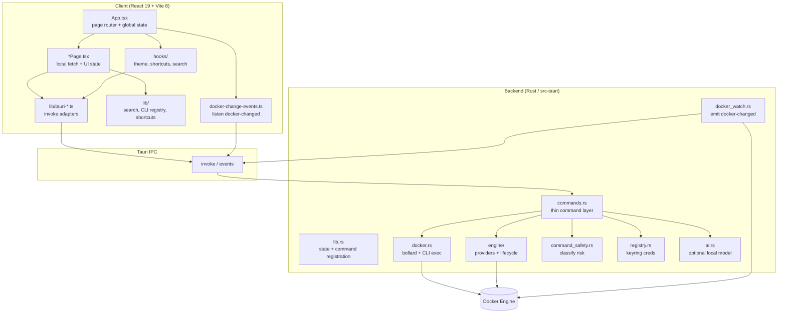

# Oxidock

Oxidock is a **desktop Docker management app** built with **Tauri 2** and **React 19**. The UI runs in a Vite-bundled webview; the Rust backend talks to Docker Engine via **bollard** and exposes typed commands to the frontend through Tauri `invoke`. Users browse containers, images, volumes, networks, and events; inspect logs and stats; manage engine providers (Docker Desktop, Colima, OrbStack, etc.); configure registries; run a guarded **CLI playground**; and use in-app docs plus intelligent search across Docker resources.

Developers want a **native, focused Docker UI** without living in the terminal or Docker Desktop alone — Oxidock centralizes visibility and common operations while still allowing raw CLI when needed.

## Features

- **Containers dashboard** — List, group, inspect, start/stop/restart/remove, live stats, Docker change events.
- **Images / volumes / networks / events** — Resource pages with search filtering and engine-aware refresh.
- **Logs viewer** — Per-container log streaming via backend.
- **CLI playground** — Arbitrary `docker` CLI execution with client-side destructive-command protection and Rust-side classification API.
- **Engine & registry settings** — Provider selection, lifecycle actions, registry CRUD, credentials in OS keyring.
- **Docs & intelligent search** — Static command lessons/registries plus cross-resource search from the title bar.

## Architecture



React owns presentation and orchestration; thin TypeScript adapters call Tauri commands; Rust modules own Docker connectivity, safety classification, registry secrets, and background watch events that push UI refreshes.

## Requirements

- [Node.js](https://nodejs.org/) 22+
- [pnpm](https://pnpm.io/) 11+ (project pins pnpm 11.1.3)
- [Rust](https://www.rust-lang.org/tools/install) stable (for the Tauri backend)
- Docker Engine running locally or via a supported provider

## Development

```bash
pnpm install
pnpm tauri dev
```

### Git hooks

Local hooks are installed automatically by `postinstall` when you run `pnpm install`.
To re-install them manually:

```bash
pnpm hooks:install
```

| Hook                 | What it does                                                                                                  |
| -------------------- | ------------------------------------------------------------------------------------------------------------- |
| `pre-commit`         | Full `pnpm lint:fix` on the repo, then `pnpm test`; re-stages your commit plus any clean files auto-formatted |
| `pre-push`           | Full `pnpm lint`, `pnpm typecheck`, and `pnpm test` before push                                               |
| `prepare-commit-msg` | If the branch starts with an issue number (e.g. `42-my-feature`), appends `Related work item: #42`            |

Disable the issue footer: `git config oxidock.hooks.issueFooter false`

### Quality checks

```bash
pnpm lint
pnpm typecheck
pnpm test
pnpm build
cd src-tauri && cargo test
cd src-tauri && cargo fmt --all -- --check
cd src-tauri && cargo clippy --all-targets -- -D warnings
pnpm doctor -- --verbose --diff
```

Combined gate:

```bash
pnpm check
```

### Dependency audits

```bash
pnpm audit --prod
cd src-tauri && cargo audit   # requires: cargo install cargo-audit
```

## Security model

- Docker commands are validated and classified in Rust (`command_safety`). **Destructive** commands require an explicit `confirmDestructive` flag from the UI after user confirmation.
- Registry credentials are stored in the OS keyring, not in config files.
- OCI registry URLs must use **HTTPS** and cannot target private or loopback hosts.
- The local AI assistant model download is verified against a pinned SHA-256.
- The webview uses a Content Security Policy; external links are limited to Docker documentation and Docker Hub via the opener plugin.

## Local AI assistant

The optional on-device assistant downloads a small GGUF model from Hugging Face on first use. The `llama-cli` sidecar must be bundled for release builds (not included in this repository). Model integrity is checked via `EXPECTED_MODEL_SHA256` in `src-tauri/src/ai.rs`.

## Project layout

| Path         | Purpose                                               |
| ------------ | ----------------------------------------------------- |
| `src/`       | React UI                                              |
| `src-tauri/` | Rust backend (Docker, registry, engine lifecycle, AI) |

## Releases

[CHANGELOG.md](CHANGELOG.md) and version bumps are managed by [Release Please](https://github.com/googleapis/release-please) from [Conventional Commits](https://www.conventionalcommits.org/) on `main` (see [CONTRIBUTING.md](CONTRIBUTING.md)). Merging the Release PR creates a `v*.*.*` tag; that tag triggers signed, notarized macOS builds on GitHub Releases. Maintainer setup and verification steps are in [RELEASE.md](RELEASE.md).

## License

MIT — see [LICENSE](LICENSE).
